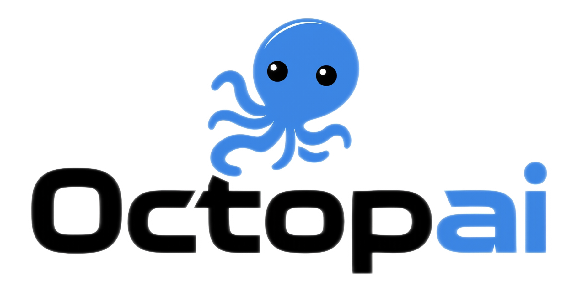

<div align="center">


  
<p align="center">
  <h1 align="center">Octopai 🐙</h1>
</p>

<p align="center">
  <strong>The Skill Evolution Intelligence Engine for AI Agents.</strong>
</p>

<p align="center">
  Everything Can Be a Skill • Skills Evolve Through Continuous Learning • Elevating AI Agent Cognition
</p>

<p align="center">
  Model(LLM) -> CPU • Agent -> OS • Skills -> Apps
</p>

<p align="center">
  <a href="https://opensource.org/licenses/MIT">
    
  </a>
  <a href="https://www.python.org/">
    
  </a>
  <a href="https://github.com/Yuan-ManX/EXO">
    
  </a>
</p>


#### [English](./README.md) | [中文文档](./README_CN.md)


</div>


## Overview

Octopai is a revolutionary AI Agent Skills Exploration, Extension, and Evolution Intelligence Engine built on a powerful core principle: **Everything Can Be a Skill • Skills Evolve Through Continuous Learning • Elevating AI Agent Cognition**. Serving OpenClaw, Claude Code, Codex, Cursor, and other intelligent agent systems, EXO transforms any resource — web pages, documents, videos, code, datasets, and more — into structured, reusable Skill content. Through intelligent learning and continuous self-evolution, Skills grow and improve over time, significantly enhancing the cognitive capabilities of AI Agents.

At the heart of Octopai lies the belief that knowledge should not be static. Every Skill created with Octopai can continuously learn from interactions, refine itself through reflection, and evolve to become more powerful, more comprehensive, and better suited to the evolving needs of AI Agents.

## Core Philosophy

Octopai's revolutionary philosophy is centered around our foundational mission and principles:


#### The Mission: Explore, Extend, Evolve AI Agent Cognition

At its core, Octopai exists to elevate AI Agent cognition through three fundamental pillars:

- **Explore** the vast knowledge available on the internet and in various file formats
- **Extend** the capabilities of AI Agents through structured, reusable skills
- **Evolve** skills through intelligent reflection and optimization to match Agent needs


#### The Principles: Everything Can Be a Skill, Skills Evolve Through Learning

Octopai's groundbreaking approach is built on two transformative principles:

- **Everything Can Be a Skill**: Any resource — web pages, PDFs, videos, code, datasets, articles — can be transformed into a structured, AI-ready Skill
- **Skills Evolve Through Learning**: Every Skill continuously learns from usage, feedback, and interactions, growing more powerful over time

Together, these principles and pillars form Octopai's revolutionary ecosystem where everything becomes a Skill, and every Skill continuously evolves to expand AI Agent cognition.


## ✨ Key Features

### ⚡ One-Click URL to Skill Conversion
Transform any internet resource into structured, AI-ready skills instantly:
- **Web Pages**: Convert URLs to structured Markdown with one command
- **Automatic Crawling**: Fetch and organize linked resources
- **Skill-Ready Output**: Directly usable by AI Agents like Claude Code, Cursor, etc.

### 🧩 Multi-Format Resource Parser
Parse and transform **any file format** into skill-ready resources:
- **Documents**: PDF, DOC, DOCX
- **Spreadsheets**: Excel (XLSX, XLS), CSV
- **Media**: Images (JPG, PNG, GIF), Videos (MP4, AVI, MOV)
- **Web**: HTML, URLs with automatic crawling
- **Text**: Markdown, JSON, YAML, plain text

### 🚀 Intelligent Evolution Engine
Advanced three-stage evolution pipeline for skill optimization:
1. **Executor**: Run candidates and capture full execution traces
2. **Reflector**: Analyze failures and identify improvement patterns
3. **Optimizer**: Generate improved candidates based on insights

Features reflective mutation, system-aware merge, and Pareto-efficient search.


### 💼 SkillHub - Centralized Skill Management
Store, organize, and evolve your skills in a centralized repository:
- **Persistent Storage**: Skills saved to disk with full history
- **Version Control**: Track skill evolution with complete version history
- **Smart Search**: Find relevant skills by keywords, tags, or categories
- **Skill Merging**: Combine complementary skills into more powerful ones
- **Usage Analytics**: Track skill usage and success rates

```python
from exo import EXO, hub_create, hub_search, hub_list, hub_stats

# Create a skill in SkillHub
skill = hub_create(
    name="Data Analyzer",
    description="Analyze CSV data files",
    prompt="Create a skill to analyze CSV data",
    tags=["data", "csv", "analysis"],
    category="data-processing"
)

# Search for skills
results = hub_search("csv analysis")

# List all skills
all_skills = hub_list(category="data-processing")

# Get statistics
stats = hub_stats()
```


### 🔗 Dual Interface: Python API + CLI
Use Octopai in the way that works best for you:
- **Python API**: Import directly into your projects for seamless integration
- **Command-Line**: Quick operations and automation through the terminal


### 🔧 High-Level API
Simplified access to all functionality:
```python
from exo import EXO, convert, create, evolve, parse

# Convert URL to skill
content = convert("https://example.com")

# Parse files as resources
resource = parse("document.pdf")

# Create skills with resources
skill = create("Analyze this data", resources=["data.csv", "ref.pdf"])

# Evolve skills
evolved = evolve("skill.py", "Improve performance")
```

## 📦 Installation

### Prerequisites
- Python 3.8 or higher
- OpenRouter API key (get one at [openrouter.ai](https://openrouter.ai))
- Cloudflare API key (optional, for enhanced URL conversion)

### 1. Clone the Repository
```bash
git clone https://github.com/Yuan-ManX/EXO.git
cd EXO
```

### 2. Install Dependencies
```bash
pip install -r requirements.txt
# or for development installation
pip install -e .
```

### 3. Configure API Keys
Copy the example environment file and fill in your values:

```bash
cp .env.example .env
# Edit .env with your API keys
```

Your `.env` file should look like:
```env
# OpenRouter API Configuration (Required)
OPENROUTER_API_KEY=your_openrouter_api_key_here

# Cloudflare API Configuration (Optional)
CLOUDFLARE_API_KEY=your_cloudflare_api_key_here
CLOUDFLARE_ACCOUNT_ID=your_cloudflare_account_id_here

# Model Configuration (Optional)
EXO_MODEL=openai/gpt-5.4
```

## 🚀 Quick Start

### Python API
```python
from exo import EXO

# Initialize EXO
exo = EXO()

# Convert URL to Markdown
content = exo.convert_url("https://example.com")

# Parse files as resources
resource = exo.parse_file("data/document.pdf")
print(resource.to_skill_resource())

# Create a skill with resources
skill = exo.create_skill(
    "Create a data analysis skill",
    resources=["data/sample.csv", "docs/reference.pdf"]
)

# Evolve a skill
evolved = exo.evolve_skill(
    "skills/my_skill.py",
    "Add better error handling and logging",
    iterations=5
)
```

### Command Line Interface
```bash
# Convert URL to Markdown
exo convert https://example.com -o output.md --crawler

# Parse a file to skill resource
exo parse document.pdf -o resource.md

# Create a skill
exo create "A CSV analysis skill" -n csv-analyzer -o skill.py

# Evolve a skill
exo evolve skill.py "Optimize for large files" -i 5

# Crawl a website
exo crawl https://example.com -o ./downloads
```

## 📚 Documentation

Comprehensive documentation is available in both English and Chinese:

- **English Documentation**: [docs/en/](./docs/en/index.md)
- **中文文档**: [docs/zh/](./docs/zh/index.md)

Quick links:
- [Getting Started](./docs/en/getting-started.md)
- [API Reference](./docs/en/api-reference.md)
- [CLI Usage](./docs/en/cli-usage.md)
- [Examples](./docs/en/examples.md)
- [Advanced Topics](./docs/en/advanced-topics.md)
- [FAQ](./docs/en/faq.md)

## 🏗️ Project Architecture

```
exo/
├── __init__.py           # Package exports
├── api.py                # High-level API interface
├── core/                 # Core functionality modules
│   ├── converter.py      # URL to Markdown conversion
│   ├── crawler.py        # Web crawling and resource download
│   ├── creator.py        # Skill creation from descriptions
│   ├── evolver.py        # Skill evolution interface
│   ├── evolution_engine.py # Advanced three-stage evolution engine
│   ├── resource_parser.py # Multi-format file parser (PDF, DOC, Excel, etc.)
│   └── skill_hub.py     # SkillHub - centralized skill management system
├── cli/                  # Command-line interface
│   └── main.py           # Main command entry point
├── utils/                # Utility functions
│   ├── config.py         # Configuration management
│   └── helpers.py        # Helper functions
├── tests/                # Comprehensive test suite
│   ├── test_converter.py
│   ├── test_creator.py
│   ├── test_evolver.py
│   ├── test_evolution_engine.py
│   ├── test_resource_parser.py
│   └── test_skill_hub.py
├── docs/                 # Documentation (English & Chinese)
│   ├── en/               # English documentation
│   └── zh/               # Chinese documentation
└── examples/             # Usage examples
```


## 💡 Skill Evolution System

Octopai's evolution engine uses a sophisticated three-stage pipeline:

```
┌────────────┐      ┌────────────┐      ┌────────────┐
│  Executor  │ ───▶ │  Reflector │ ───▶ │ Optimizer  │
│            │      │            │      │            │
│ Run candi- │      │ Analyze    │      │ Generate   │
│ dates, cap-│      │ traces to  │      │ improved   │
│ ture traces│      │ diagnose   │      │ candidates │
└────────────┘      └────────────┘      └────────────┘
```

**Key Concepts:**
- **Actionable Side Information (ASI)**: Diagnostic feedback that guides evolution
- **Pareto Frontier**: Maintains candidates that excel in different ways
- **Reflective Mutation**: Targeted improvements based on failure analysis
- **System-Aware Merge**: Combines complementary strengths from multiple candidates


## 📄 License

This project is licensed under the MIT License - see the [LICENSE](LICENSE) file for details.


## 🤝 Contributing

We welcome contributions! Please see our contribution guidelines (coming soon) for details on how to get started.


## ⭐ Star History

If you like this project, please ⭐ star the repo. Your support helps us grow!

<p align="center">
  <a href="https://star-history.com/#Yuan-ManX/Octopai&Date">
    
  </a>
</p>


## 📞 Support & Community

- **Issues**: [GitHub Issues](https://github.com/Yuan-ManX/EXO/issues)
- **Documentation**: [docs/](./docs/README.md)


**Octopai** - Empowering AI Agents to Explore, Extend, and Evolve their cognitive capabilities.
